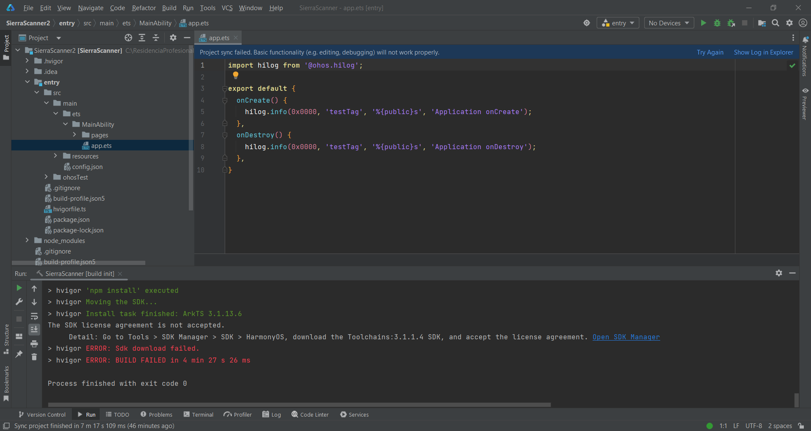
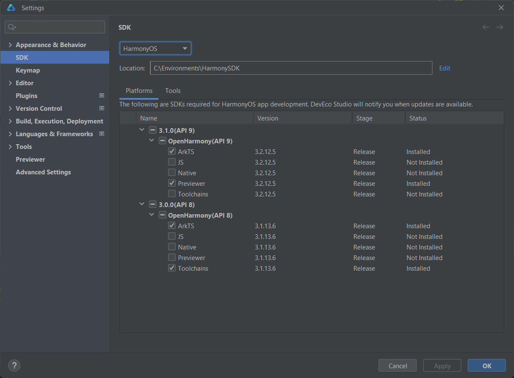
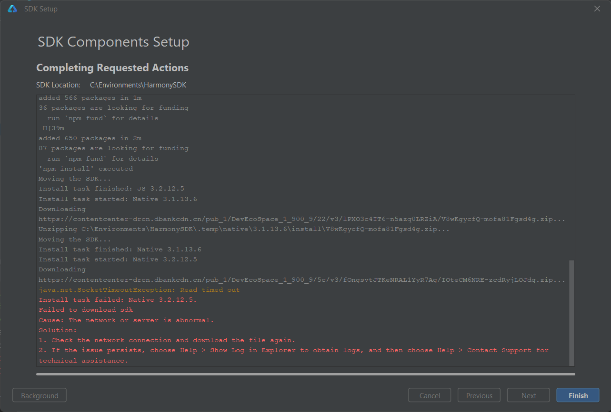
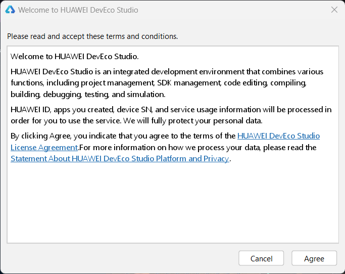
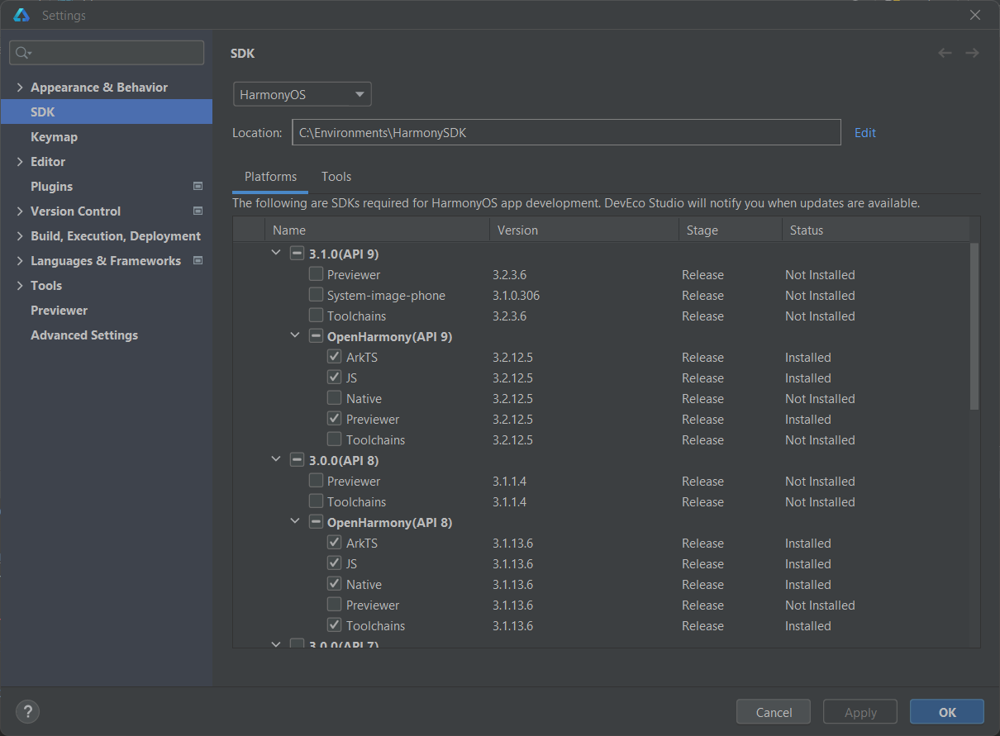
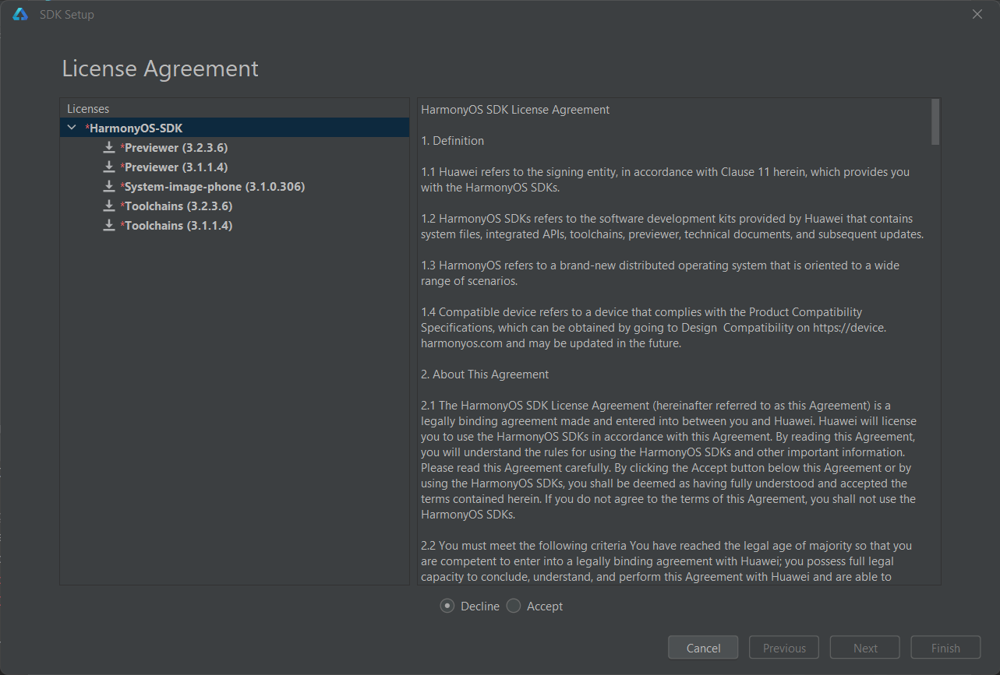
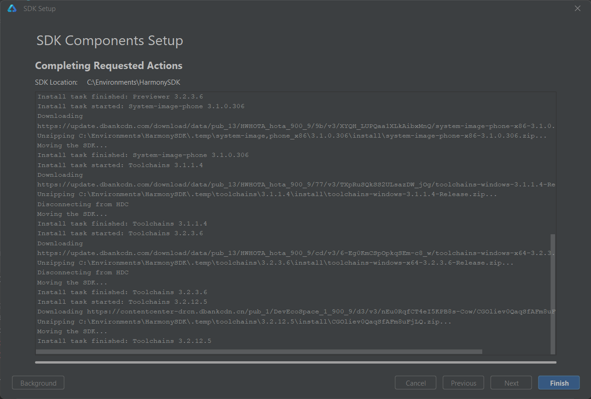
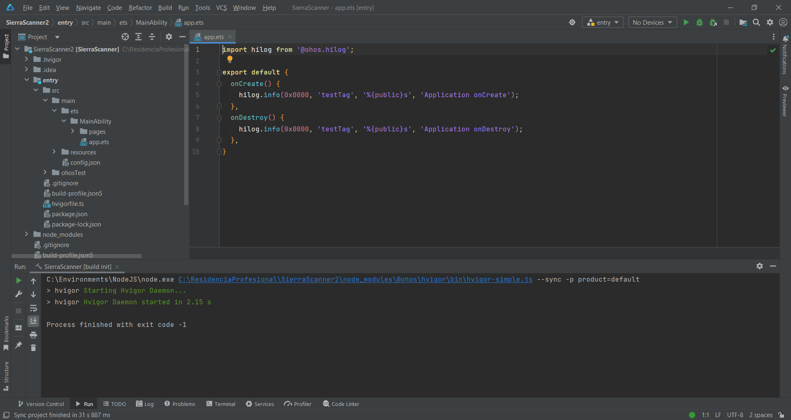

# Problema o error

Al terminar de instalar y configurar DevEco Studio por primera vez, como se ha mencionado en secciones anteriores, se abrirá una terminal en la que se realizarán diversas instalaciones y descargas de contenido que el IDE realiza para que la aplicación propia DevEco así como la aplicación que será desarrollada funcione correctamente. No obstante, es posible que aparezca un error en la terminal como se muestra en la siguiente pantalla:

Este error aparece debido a que, en el proceso de configuración inicial de DevEco Studio, no se permitió descargar el SDK de HarmonyOS, por lo cuál, será necesario instalarlo.

# Solución o soluciones

## Solución 1

Como primer paso se debe abrir el SDK Manager. Para ello, es necesario dar click al apartado "Tools" en la barra de herramientas del lado superior izquierdo del IDE. Posteriormente, de las opciones mostradas, seleccionar "SDK Manager", al hacerlo, se mostrará la siguiente imagen.

Como se aprecia en la imagen, hay diversos elementos que no están instalados en el SDK de HarmonyOS tanto en la versión API 9 como en la 8. Para ello, es necesario dar click derecho sobre todas las opciones que se encuentran desmarcadas para seleccionarlas y una vez hecho esto dar click en Apply. Al hacerlo, se desplegará una ventana emergente indicando los componentes que serán instalados así como el espacio que quedará ocupado en el disco luego de realizar la instalación, dar click en Ok. 

## Solución 2

En algunos casos, la solución anterior es suficiente para que todo funcione adecuadamente. No obstante, es posible que se muestre una vez más, la siguiente pantalla:

Si esto ocurre, será necesario realizar un paso adicional. Como bien se sabe, y se ha mencionado previamente en el presente tutorial, muchas de las ventajas y facilidades en el proceso de desarrollo son únicas y exclusivas para aquellos desarrolladores ubicados en la China continental. Por el citado motivo, es necesario "romper" momentáneamente las reglas y realizar la modificación de un archivo. Este archivo, contiene información acerca de la ubicación o región en la que se encuentra la aplicación. Por este motivo, será necesario modificar este archivo para que al entrar al DevEco Studio, la aplicación asuma que se está en la China continental.

1. Como primer paso es necesario cerrar el DevEco Studio para que las modificaciones que se realicen tomen efecto al abrir nuevamente la aplicación y no existan conflictos con las configuraciones actuales.
2. Una vez con el IDE cerrado, buscar la siguiente ruta en el explorador de archivos

		C:\Users\tuNombreDeUsuario\AppData\Roaming\Huawei\DevEcoStudio3.1\options

3. Una vez encontrado este directorio, se debe encontrar el archivo de nombre *country.region.xml* y dar doble click en él.
4. Al hacerlo se mostrará en la aplicación que esté seleccionada por defecto el siguiente código

		<application>
			<component name="CountryRegionSetting">
				<countryregion name="US"/>
			</component>
		</application>

5. Para solucionar el problema, es necesario cambiar la nomenclatura del país en el apartado ***countryregion name=""***, es posible que la región esté puesta en US, haciendo referencia a Estados Unidos o MX, haciendo referencia a México, lo único que se debe hacer es cambiar las iniciales a CN, que son las iniciales para China. Una vez realizada esta modificación, guardar el archivo y cerrarlo.
6. Ahora bien, es momento de abrir nuevamente DevEco Studio, al hacerlo se mostrará la siguiente pantalla:

7. Dar click en "Agree" y entonces se cerrará la ventana y se abrirá el IDE. Nuevamente, la terminal se abrirá y nuevamente dará error al momento de que intente descargar el SDK. Sin embargo, en este momento, al abrir el SDK Manager se mostrarán más opciones como se muestra a continuación.
8. 

8. A continuación, seleccionar todo lo que está deseleccionado tanto para API 9, OpenHarmony API 9, API 8 y OpenHarmony API 8 ya que son las versiones que más se estarán utilizando. Como se mencionó previamente, dar click derecho a las casillas de todas las opciones a seleccionar y al terminar dar click en "Apply". Cuando se muestre el mensaje de confirmación, dar click en Ok.
9. Luego de hacerlo se mostrará la siguiente pantalla

10. Este es el acuerdo de licencia del usuario para HarmonyOS SDK. Basta con dar click en "Accept" y dar click en "Next" posteriormente. Luego de hacerlo, comenzará la descarga de los elementos seleccionados. Al terminar, la pantalla debe verse de la siguiente manera:

11. Dar click en Finish y entonces ahora la pantalla de componentes del SDK debe tener todo palomeado para API 8 y 9. Una vez que esto se ha comprobado, dar click en Ok. Ahora bien, para que las configuraciones tengan efecto, es necesario cerrar y volver a abrir DevEco Studio.
12. Una vez que la terminal termine con sus procesos, la pantalla y terminal deben verse de la siguiente manera.

Con esto, el problema del SDK queda resuelto.

[Volver al Índice](Indice%20Errores.md)
[Volver al inicio](../../Bitácora%20de%20Proyecto.md)
