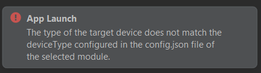
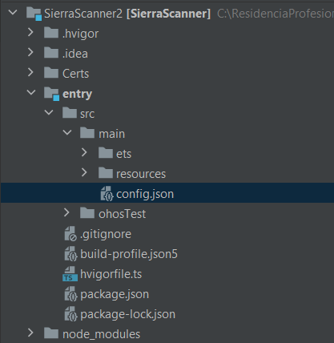
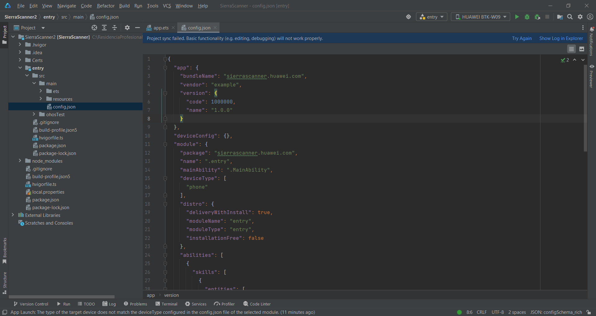
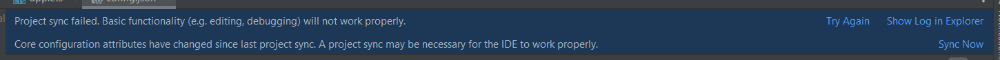

# Problema

Al intentar probar la aplicación en un dispositivo físico real, en particular la Huawei MatePad 11.5, el mensaje que se muestra en la parte inferior derecha de la pantalla es el siguiente.

Lo que dice este mensaje de error es que el dispositivo en el que se está tratando de probar el programa, no coincide con el tipo de dispositivo que se declaró al momento de crear el proyecto. Si uno rememora, al crear el proyecto, se seleccionó la versión API 8, esta versión, únicamente permitía o mostraba "Phone" en las opciones de dispositivos para los cuales se iba a desarrollar el programa. Es por ello que este error se sucita.

# Solución

Para resolver este problema, es necesario ubicar un archivo de configuración. Este archivo contiene diversas declaraciones relacionadas a la funcionalidad del proyecto. Dado que este archivo controla las configuraciones del proyecto en general, se encuentra en la ruta:

		NombreDelProyecto/Entry/src/main/config.json

A continuación, se muestra una imagen para tener una mejor referencia visual sobre dónde se encuentra el archivo *config.json*.

Se debe dar doble click al archivo y se mostrará la siguiente pantalla:

En la línea 15, si uno observa de manera detenida, dice *deviceType*, este es el apartado en el cual se debe realizar la modificación de los parámetros para no tener el error. La primera opción sería borrar *"phone"* y reemplazarlo por *"tablet"* o bien, se puede poner una coma, dar click en enter y entonces agregar la opción tablet de la siguiente manera:

		"deviceType": [  
			  "phone",
			  "tablet"  
		],

Esto permitirá que si en algún momento la aplicación se desea probar en un dispositivo celular, sea posible hacerlo sin la necesidad de tener que modificar las configuraciones nuevamente en un futuro. 

Independientemente de las modificaciones que se hagan, luego de hacerlas, aparecerá el siguiente mensaje en letras azules en la parte superior de la pantalla:

Basta con dar click en "Sync Now" para que la terminal se active y realice el refresh de las configuraciones.

De esta manera, al intentar probar la aplicación en la tablet, no existirán mensajes de error.

[Volver al Índice](Indice%20Errores.md)
[Volver al inicio](../../Bitácora%20de%20Proyecto.md)

